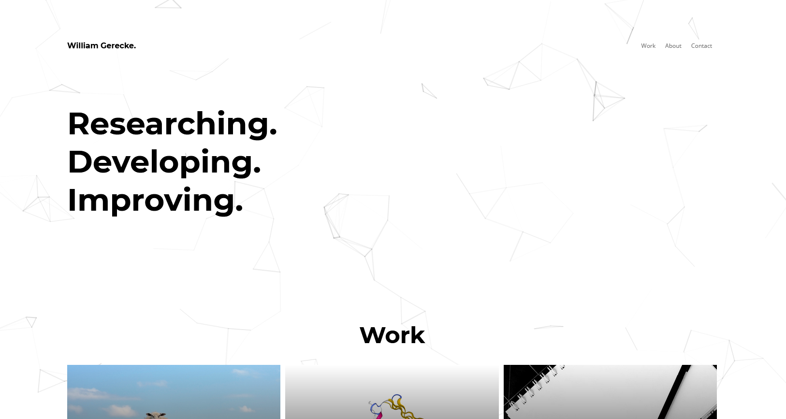

# `portfolio`

Hi, my name is Will and this is the repository containing code for my personal website (or portfolio). The website can be accessed  at [https://william.gerecke.io/](https://william.gerecke.io/). Feel free to clone, fork, or contribute to the repository if you like it!

## Code

The code is structured with config files at the top level. The two main directories are `public` which contains the compiled server and `src` which contains the code. Inside of `src` are the following elements:

- `data.js`: serves as a hard-coded CMS for the content of the page.
- `images`: contains all of the images and media files that are reqired by the website.
- `pages`: contains `404.html` and `index.html`. `index.html` uses components to construct the main website.
- `styles`: is a flat directory of all of the `scss` files that the page uses. `index.html` imports `main.scss` and `main.scss` imports all of the other style pages.
- `utils`: contains unitary files that expose one or more functions to perform tasks that do not generate parts of the website.
- `.github/workflows`: contains the workflow `.yml` files used for GitHub Actions. `deploy.yml` is configured to use GitHub Secrets to deploy the website to a pre-configured DigitalOcean droplet, but should work on any ubuntu server that accepts SSH connections and is configured correctly.

## Notes

1. `Jumbotron.js` is the component that is responsible for the animation in the background of the header. This animation is created using `p5.js` in instance mode, but in order to build the page using Gatsby, nothing can use the `window` variable (which `p5.js` does). In order to avoid this, `p5.js` must be laoded lazily using the asynchronous es6 `import()` syntax inside of an `if (window)` statement.

## Building

The code comes with a development server that can be started using `npm start`. A production page can be compiled using `npm build`.

## Sources

This project is built using [Gatsby](https://www.gatsbyjs.com/).

The initial layout and responsive design for this project were inspired by this [portfolio template](https://github.com/chetanverma16/react-portfolio-template).

For the animation in the background of the header, this page uses [`p5.js`](https://p5js.org/).

For the render of the protein in the image for work, I used the [PDB](https://www.rcsb.org/) website's WebGL renderer to show the structure 6msp.
